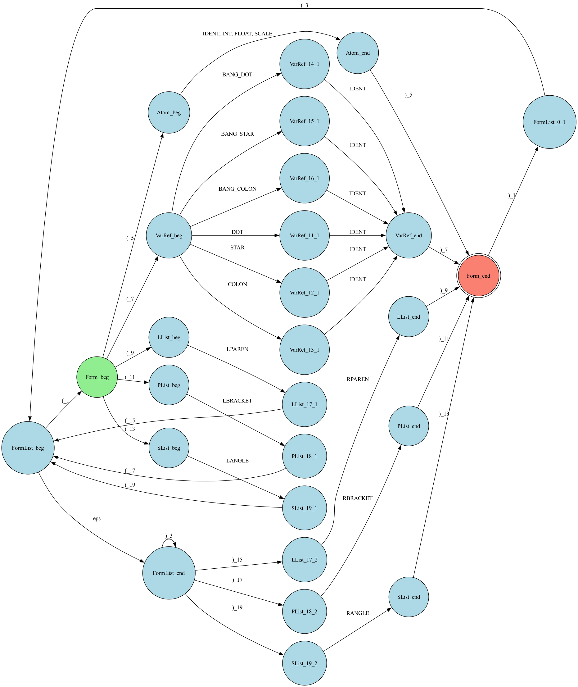

# Planner Language Interpreter

Интерпретатор языка Плэннер, реализованный на Python. Включает лексер, парсер на основе L-графа, интерпретатор с механизмом возвратов и графический IDE на Tkinter.

## Структура проекта

```
src/
  lexer/           Лексический анализатор: разбивает текст на токены
  parser/          Синтаксический анализатор: строит AST из токенов с помощю L-графа
  interpreter/     Интерпретатор: вычисляет формы при обходе AST, поддерживает механизм возвратов
  gui/             Графический IDE (Tkinter)
  test/            end-to-end тесты интерпретатора
examples/          Примеры программ (.plan)
```

## Грамматика языка

```
Form     -> Atom | VarRef | LList | PList | SList

Atom     -> IDENT | INT | FLOAT | SCALE

VarRef   -> '.'  IDENT | '*'  IDENT | ':'  IDENT
          | '!.' IDENT | '!*' IDENT | '!:' IDENT

LList    -> '(' FormList ')'
PList    -> '[' FormList ']'
SList    -> '<' FormList '>'

FormList -> Form FormList | ε
```

## L-граф грамматики


## Запуск тестов

Все тесты из корня проекта:

```bash
python -m pytest
```

Запуск конкретного модуля:

```bash
python -m pytest src/lexer/test/test_lexer.py -v
python -m pytest src/parser/test/test_reader.py -v
python -m pytest src/interpreter/test/test_interpreter.py -v
python -m pytest src/interpreter/test/test_backtracking.py -v
python -m pytest src/test/test_pipeline.py -v
```

## Запуск графического IDE

```bash
python main.py
```
